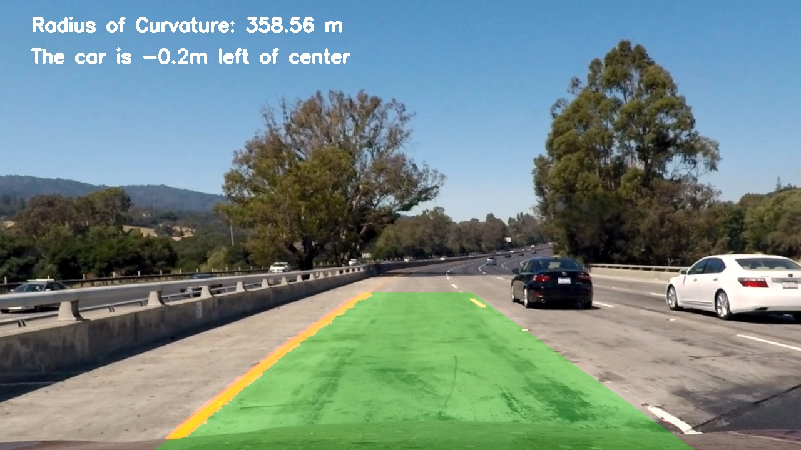

## Advanced Lane Finding

This project aims at finding boundries of lane lines area as well as the radius of curvature and car's position to the lane.

### Environment and Dependencies

The code should run under Python3.6 with following packages:

+ python-opencv
+ sklearn
+ scipy
+ matplotlib

### Directory and Files

Main code is in jupyter notebook `P2.ipynb` ([link->](https://github.com/DonaldRR/AdvancedFindLanes/blob/master/P2.ipynb)) and functions are in `utils.py` ([link->](https://github.com/DonaldRR/AdvancedFindLanes/blob/master/utils.py)).

Input video is [here](https://github.com/DonaldRR/AdvancedFindLanes/blob/master/challenge_video.mp4) and Output video is [here](https://github.com/DonaldRR/AdvancedFindLanes/blob/master/processed_project_video.mp4).

The **IMPORTANT** `WRITEUP.md` is [here](https://github.com/DonaldRR/AdvancedFindLanes/blob/master/WRITEUP.md). It allows you better understand what the code is doing.

### Run

Executable code is in `P2.ipynb`. Run it under jupyter notebook.
